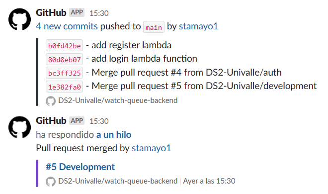

# Watch queue backend

Backend with serverless Framework Node HTTP API on AWS

## Architecute


## Notifications

Our repository is associated to slack, so every time a commit, push, pull request, or merge is performed, it notifies each of the developers, and a joint group we have.

:link: [Slack](https://app.slack.com/client/T053Q1SDB5E/C0532R2T528)



## Initialization 
1. Download and install [Node 18.12.1](https://nodejs.org/download/release/v18.12.1/)
2. Clone this repository 
3. Install development dependencies
  `npm install` 


### Deployment

```
$ serverless deploy
```

After deploying, you should see output similar to:

```bash
Deploying aws-node-http-api-project to stage dev (us-east-1)

✔ Service deployed to stack aws-node-http-api-project-dev (152s)

endpoint: GET - https://xxxxxxxxxx.execute-api.us-east-1.amazonaws.com/
functions:
  hello: aws-node-http-api-project-dev-hello (1.9 kB)
```

_Note_: In current form, after deployment, your API is public and can be invoked by anyone. For production deployments, you might want to configure an authorizer. For details on how to do that, refer to [http event docs](https://www.serverless.com/framework/docs/providers/aws/events/apigateway/).

### Invocation

After successful deployment, you can call the created application via HTTP:

```bash
curl https://xxxxxxx.execute-api.us-east-1.amazonaws.com/
```

Which should result in response similar to the following (removed `input` content for brevity):

```json
{
  "message": "Go Serverless v2.0! Your function executed successfully!",
  "input": {
    ...
  }
}
```

### Local development

You can invoke your function locally by using the following command:

```bash
serverless invoke local --function hello
```

Which should result in response similar to the following:

```
{
  "statusCode": 200,
  "body": "{\n  \"message\": \"Go Serverless v3.0! Your function executed successfully!\",\n  \"input\": \"\"\n}"
}
```